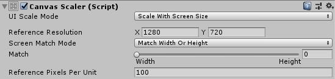
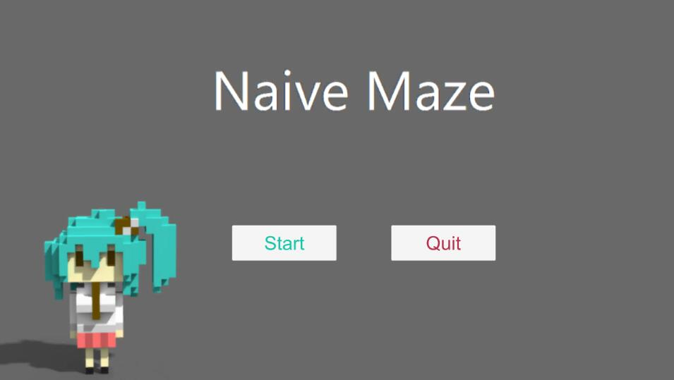
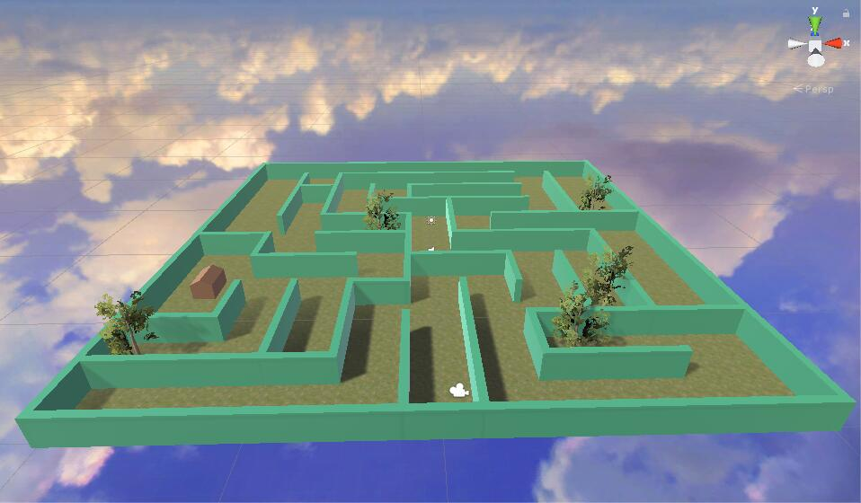
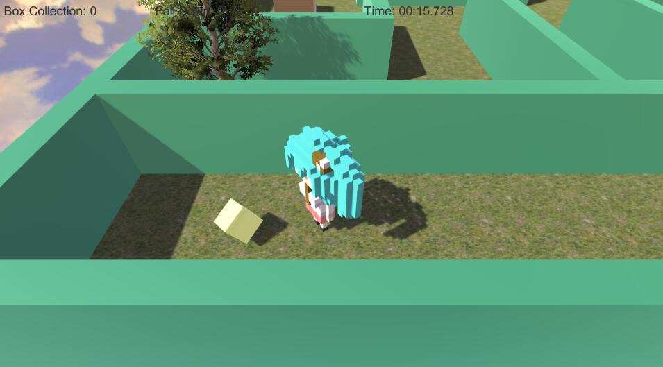
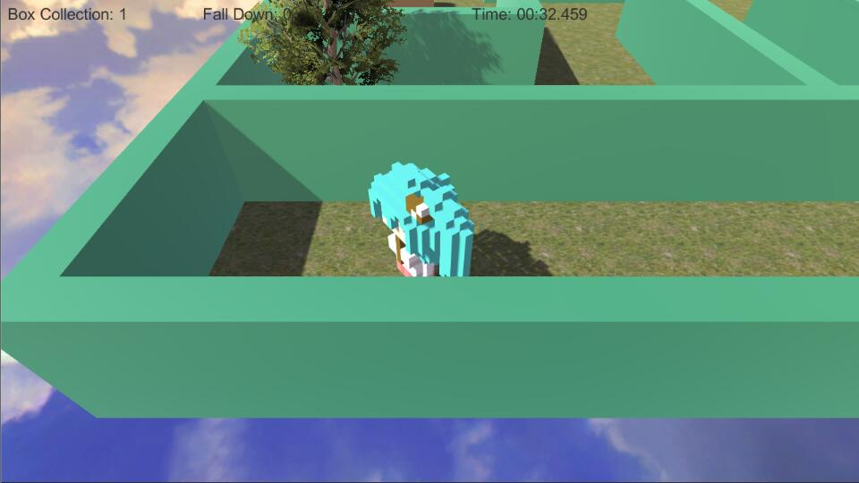
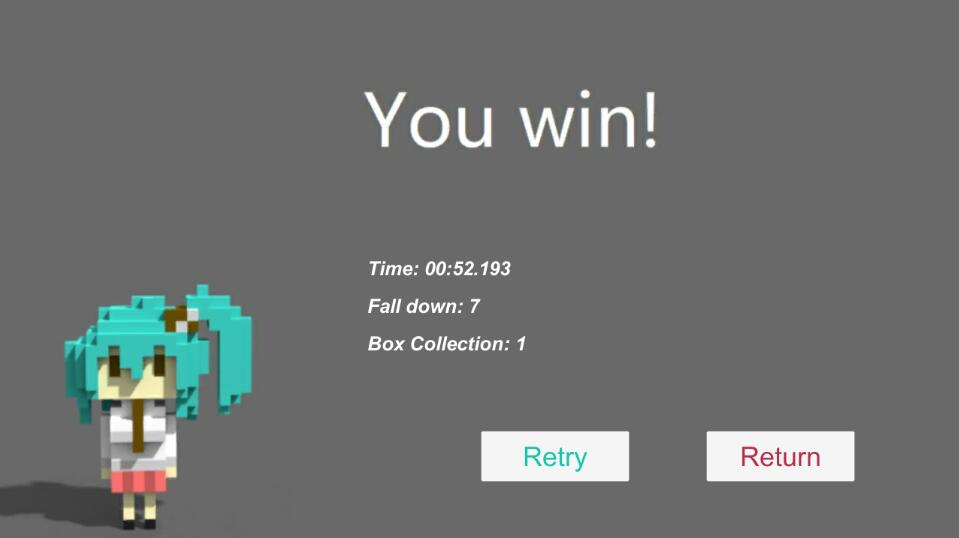

#  Naive Maze作业报告

​	本次作业使用Unity3d实现了一个3D的走迷宫游戏。

### 1、游戏分析

​	首先游戏要具有主菜单，玩家在主菜单中可以选择开始游戏与退出游戏。当玩家选择开始游戏时，需要切换到迷宫的场景，进行计时，并且记录玩家收集箱子的数量与控制失误导致的倒地次数。玩家在游戏中时可以随时退回到主菜单，而当玩家成功通关迷宫后则要切换到成绩结算界面。在成绩结算界面中玩家又可以选择重新挑战与返回主菜单。

​	这样我们首先就要创建Menu、Naive Maze与Result三个Scene，分别实现各自场景的功能。

### 2、游戏主菜单的建立

​	在名为Menu的Scene中添加GameObject - UI - Raw Image。这时候有一个Canvas生成，将其调整为自适应屏幕分辨率，如图所示：



之后自己制作menu.jpg，并且添加到Raw Image上，这样，菜单界面的背景就弄好了。

​	然后通过GameObject - UI - Button创建一个StartButton和一个CloseButton，玩家点击StartButton时开始游戏，点击CloseButton时退出游戏。在Canvas上创建MenuController脚本，实现玩家点击Button时的Scene的切换，脚本代码如下：

```c#
using System.Collections;
using System.Collections.Generic;
using UnityEngine;
using UnityEngine.SceneManagement;
using UnityEngine.UI;

public class MenuController: MonoBehaviour
{
    void Start()
    {
        GameObject.Find("StartBtn").GetComponent<Button>().onClick.AddListener(() => { OnClickStartBtn(); });
        GameObject.Find("CloseBtn").GetComponent<Button>().onClick.AddListener(() => { OnCloseApp(); }); //绑定Button和功能
    }

    void OnClickStartBtn()
    {
        SceneManager.LoadScene("Naive Maze"); //跳转到迷宫界面
    }

    void OnCloseApp()
    {
        Application.Quit(); //退出游戏
    }

}
```

​	最后调整好各组建的大小、位置，主菜单界面就算完成了。效果如下图：



### 3、游戏场景的制作

​	进入到名为Naive Maze的Scene中，首先要做的是添加地形。添加GameObject - 3D Object - Terrain，并将其调整到合适的位置，并调整地形的大小。由于是一个迷宫游戏，我在此次作业中使用的地形为一个平地。然后是添加地形的纹理，并且添加树木。首先我从Asset Store中下载了Standard Assets资源包，并且将其中需要用到的资源导入到了项目中。然后在Paint terrain界面中选择Paint Texture，添加了地形的纹理。然后通过Paint tree界面添加了几棵树木。这样，地形就构建好了。

​	然后是迷宫的建立，通过建立多个GameObject - 3D Object - Cube，并且调整尺寸与位置构建好了一个Naive的迷宫，并将其上色。

​	之后便是导入天空盒。我从网上找了一个漂亮的天空盒，将其下载到工程的目录下。由于项目本来默认的背景就是一个天空盒，于是我将下载的天空盒直接拖入到界面中，便成功显示了出来。

​	然后导入了Standard Assets中的一个房屋模型，并且将其设置为了终点，并且添加了名为`Terminal`的Tag。到现在，整个场景便制作完成了。场景效果如下：



### 4、背景音乐的导入

​	首先我下载了HuaShuiYue.mp3，放到工程目录下。然后将其直接拖入到工作区，运行游戏时它就会自动播放了，将它属性里面的Loop勾上，这样就能在播放完成时自动循环了。

### 5、外部三维模型的载入

​	我使用MagicaVoxel，参照视频https://www.bilibili.com/video/av11489871构建了一个三维模型，并导出为obj文件，然后将其放到项目目录下。同样的将其拖入到场景中，便能够显示出来了。不过这里出现了一个问题：unity给出的模型的中心并不在它的中心上。这样，无论是碰撞检测还是控制移动都会出现问题。于是我建立了一个名为Player的Empty的GameObject，并将模型作为其一个子类，将模型的中心对准Player的中心，以后的碰撞检测之类的操作都在Player上进行，问题就解决了。

​	然后我为Player建立了一个Box Collider，并调整大小至正好包住模型；然后将其设置为刚体，外部三维模型的导入便完成了。

### 6、模型的控制

​	为Player建立一个脚本，并且写入如下的代码：

```c#
using System.Collections;
using System.Collections.Generic;
using UnityEngine;
using UnityEngine.UI;
using UnityEngine.SceneManagement;

public class PlayerController : MonoBehaviour
{
    public float speed;
    public float rotSpeed;

    void Update()
    {
        if (Input.GetKey(KeyCode.W) || Input.GetKey(KeyCode.UpArrow))
        {
            transform.position += transform.forward * speed * Time.deltaTime;
        }
        if (Input.GetKey(KeyCode.D) || Input.GetKey(KeyCode.LeftArrow))
        {
            transform.Rotate(Vector3.up * Time.deltaTime * rotSpeed);
        }
        if (Input.GetKey(KeyCode.A) || Input.GetKey(KeyCode.RightArrow))
        {
            transform.Rotate(Vector3.up * Time.deltaTime * (-rotSpeed));
        }
        if ((this.transform.eulerAngles.x > 90 && this.transform.eulerAngles.x < 270) || (this.transform.eulerAngles.z > 90 && this.transform.eulerAngles.z < 270))
        {
            this.transform.eulerAngles = new Vector3(0, 0, 0); //防止模型倒地
        }
    }
}
```

然后玩家就能够通过“W”“A”“D”或“↑”“←”“→”来控制角色了。于此同时我们调整摄像机为跟随Player的状态，于是同时为Camera建立一个脚本，并写入如下代码：

```c#
using System.Collections;
using System.Collections.Generic;
using UnityEngine;

public class CameraController : MonoBehaviour
{
    public GameObject player;
    private Vector3 offset;

    void Start()
    {
        offset = transform.position - player.transform.position;
    }

    void LateUpdate()
    {
        transform.position = player.transform.position + offset;
    }
}
```

这样，Camera便会跟着Player进行移动了。

### 7、碰撞响应

​	参照Roll-a-ball Tutorial中的收集物制作方法制作了收集物，并将其存为了一个Prefab，将它的Tag设置为`Pick Up`，然后在PlayerController中添加碰撞检测的代码以实现玩家收集物体的效果：

```c#
void OnTriggerEnter(Collider other)
{
    if (other.gameObject.CompareTag("Pick Up"))
    {
        other.gameObject.SetActive(false);
    }
}
```

当玩家碰到Pick Up时，该物体会消失，即视为玩家成功收集了该物体。





### 8、二维用户界面

​	添加了GameObject - UI - Text来记录玩家实时的游玩情况：时间、物体的收集数量和摔倒的次数。实现该功能的代码与Roll-a-ball Tutorial中的UI界面代码类似：

```c#
void SetCountText()
{
    countText.text = "Box Collection: " + count.ToString();
    downText.text = "Fall Down: " + downCount.ToString();
}
```

建立SetCountText功能，在每次玩家触发收集物体或者摔倒时都会对次数进行计算，并且调用该函数，这样玩家就能实时看到自己的游戏状态了。

​	同时，由于是一个走迷宫游戏，我还加入了计时功能，这部分的代码放在了Update()中，以保证时间随时都在更新，代码如下：

```c#
timeSpend += Time.deltaTime;

minute = ((int)timeSpend) / 60;
second = (int)timeSpend - minute * 60;
millisecond = (int)((timeSpend - (int)timeSpend) * 1000);

timeText.text = string.Format("Time: {0:D2}:{1:D2}.{2:D3}", minute, second, millisecond);
```

这样便有了”分:秒.毫秒“格式的时间显示。显示的效果如碰撞响应中图片所示。

### 9、游戏胜利条件

​	玩家抵达终点（房屋处）即为胜利。由于已经将终点的Tag设置成了`Terminal`，我们先添加一个变量`win`来记录玩家是否抵达终点的状态，然后只需要在PlayerController的onTriggerEnter中添加如下代码：

```c#
if (other.gameObject.CompareTag("Terminal"))
{
    win = 1;
    SceneManager.LoadScene("Result");
}
```

当玩家胜利时，变化跳转到Result的Scene去。

### 10、结算界面的计时、计分系统

​	首先，结算界面按钮、背景的制作方法与主菜单相同，这部分不再说明。然后结算界面需要继承我们在Naive Maze这个Scene中所记录的时间、收集数量、摔倒次数的数据，这时我们就要修改Player Controller的代码，使得数据能够成功传递过来：

```c#
if (other.gameObject.CompareTag("Terminal"))
{
    win = 1;
    PlayerPrefs.SetString("time", string.Format("{0:D2}:{1:D2}.{2:D3}", minute, second, millisecond));
    PlayerPrefs.SetString("fd", downCount.ToString());
    PlayerPrefs.SetString("bc", count.ToString());
    SceneManager.LoadScene("Result");
}
```

我使用了PlayerPrefs的方法来进行跨场景的数据传输。同时，在ResultController中添加如下代码来获取我们存储的数据并显示在结算界面中：

```c#
Time.text = "Time: " + PlayerPrefs.GetString("time");
FallDown.text = "Fall down: " + PlayerPrefs.GetString("fd");
BoxCollection.text = "Box Collection: " + PlayerPrefs.GetString("bc");
```

获胜一次后的结算界面如下：



可以看到数据成功地显示了出来。至此，整个项目完成了。

