# HW3 实验报告

### Shader的实现

法线Shader、纹理Shader和光照Shader根据参考文件编写。首先建立法线Shader，定义`VertexData`和`FragmentData`两个类型：

```c#
struct VertexData {
    float4 position : POSITION;
    float3 normal : NORMAL;
};

struct FragmentData {
    float4 position : SV_POSITION;
    float3 normal : TEXCOORD0;
};
```

在Vertex Shader中将法线方向转换到世界坐标系下，

```c#
FragmentData MyVertexProgram(VertexData v) {
    FragmentData i;
	i.position = UnityObjectToClipPos(v.position);
	i.normal = mul(transpose((float3x3)unity_WorldToObject), v.normal);
	i.normal = normalize(i.normal);
	return i;
}
```

然后直接在Fragment Shader中直接返回法线方向，法线Shader就完成了，输出结果如下：

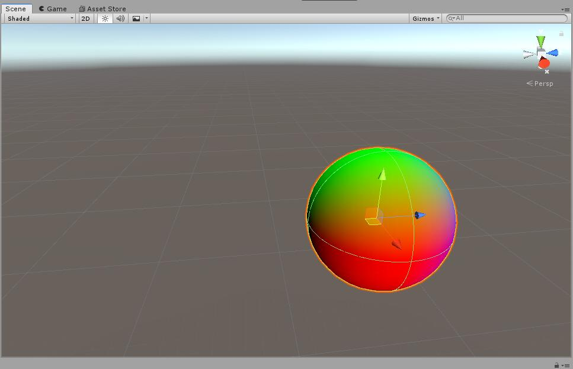

然后编写纹理Shader，为了能够使用纹理，先在`Properties`中增加一个名为`_MainTex`的纹理属性。同时在`VertexData`和`FragmentData`中添加`uv`属性，在Vertex Shader中将`VertexData.uv`赋值给`FragmentData.uv`并在Fragment Shader中返回`_MainTex`位于`FragmentData.uv`位置的颜色值：

```c#
float4 MyFragmentProgram (FragmentData i) : SV_TARGET {
    return tex2D(_MainTex, i.uv);
}
```

然后添加`_MainTex_ST`属性来使得材质能够进行缩放和偏移。然后在Vertex Shader中添加`i.uv = TRANSFORM_TEX(v.uv, _MainTex);`来实现缩放偏移操作。这样纹理Shader就完成了，将纹理图片贴到球体上得到的结果如下：

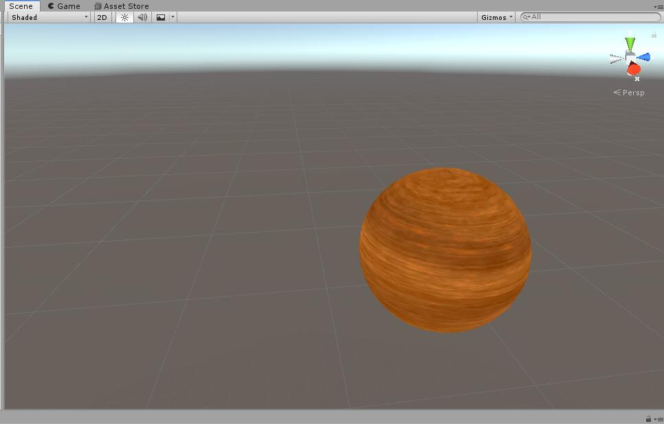

最后是光照Shader。在光照Shader中实现环境光、漫反射和Blinn Phong高光效果三部分。首先在`Properies`加入`_Diffues`和`_Speular`来设置漫反射和高光的光的颜色。

在漫反射中，首先要计算入射光方向以及颜色，然后根据Lambert光照模型中的公式

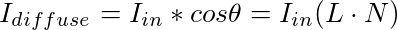

来计算漫反射光，于是在Fragment Shader中加入如下代码来实现上述公式：

```c#
float3 lightDir = normalize(_WorldSpaceLightPos0.xyz);
float3 lightColor = _LightColor0.rgb;
float3 diffuse = _Diffuse.rgb * tex2D(_MainTex, i.uv).rgb * lightColor * DotClamped(lightDir, i.normal);
```

最后得到的`diffuse`即为漫反射光的结果。如果考虑到物体本身的颜色，再将`diffuse`与`tex_2D(_MainTex, i.uv).rgb`相乘。

然后是环境光，在Fragment Shader中加入环境光的计算：

```c#
fixed3 ambient = UNITY_LIGHTMODEL_AMBIENT.xyz * tex2D(_MainTex, i.uv).rgb;
```

然后是实现高光效果，根据Blinn Phong模型的公式

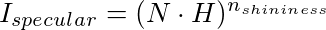

先进行H的计算，再对高光效果进行计算。首先在`FragmentData`中加入`worldPos`计算视线的方向，并在`Properties`中加入`_Shininess`对应公式中的乘方系数，然后在Fragment Shader中加入如下代码来实现上述公式：

```c#
float3 viewDir = normalize(_WorldSpaceCameraPos - i.worldPos);
float3 halfVector = normalize(lightDir + viewDir);
fixed3 specular = _Specular.rgb * lightColor * pow(DotClamped(halfVector, i.normal), _Shininess);
```

最后将`ambient`、`diffuse`、`specular`的结果相加作为最后的结果返回，便得到了较好的光照效果，并且能够通过UI界面进行漫反射光和高光颜色的调整，当颜色都调为白色时得到的结果如下：

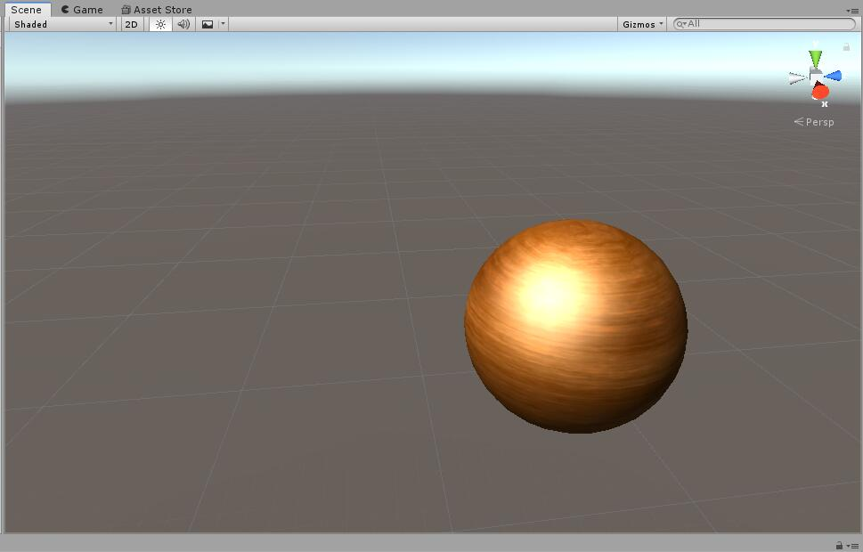

### Shader的GUI 的实现

建立`CustomShaderGUI.cs`使之继承`ShaderGUI`类，然后在Shader文件最后加入`CusttomEditor "CustomShaderGUI"`声明使用刚建立的类作为自定义Editor。在`CustomShaderGUI.cs`中定义变量

```c#
MaterialEditor editor;
MaterialProperty[] properties;
Material target;
```

然后就可以在面板上添加材质属性了。定义一个枚举类`Choice`来表示选择的显示模式

```c#
enum Choice
{
    NORMAL_ONLY, TEX_ONLY, BLINN_PHONG
}
```

在`OnGUI()`中，首先判断当前选择的Keyword状态：

```c#
Choice choice = Choice.NORMAL_ONLY;
if (target.IsKeywordEnabled("USE_NORMAL"))
    choice = Choice.NORMAL_ONLY;
if (target.IsKeywordEnabled("USE_TEX"))
    choice = Choice.TEX_ONLY;
if (target.IsKeywordEnabled("USE_SPECULAR"))
    choice = Choice.BLINN_PHONG;
```

然后创建下拉栏，同时判断是否被更新，并更新相应的Keyword状态：

```c#
EditorGUI.BeginChangeCheck();
choice = (Choice)EditorGUILayout.EnumPopup(new GUIContent("Shader Type"), choice);

if (EditorGUI.EndChangeCheck())
{
    if (choice == Choice.NORMAL_ONLY)
    {
        target.EnableKeyword("USE_NORMAL");
        target.DisableKeyword("USE_TEX");
        target.DisableKeyword("USE_SPECULAR");
    }
    else if (choice == Choice.TEX_ONLY)
    {
        target.DisableKeyword("USE_NORMAL");
        target.EnableKeyword("USE_TEX");
        target.DisableKeyword("USE_SPECULAR");
     }
    else
    {
        target.DisableKeyword("USE_NORMAL");
        target.DisableKeyword("USE_TEX");
        target.EnableKeyword("USE_SPECULAR");
     }
}
```

然后根据Keyword状态判断所选择的Shader种类及显示的用户可定义的参数：

```c#
if (choice != Choice.NORMAL_ONLY)
{
    MaterialProperty mainTex = FindProperty("_MainTex", properties);
    GUIContent mainTexLabel = new GUIContent(mainTex.displayName);
    editor.TextureProperty(mainTex, mainTexLabel.text);

    if (choice == Choice.BLINN_PHONG)
    {
        MaterialProperty diffuse = FindProperty("_Diffuse", properties);
        GUIContent shininessLabe1 = new GUIContent(diffuse.displayName);
        editor.ColorProperty(diffuse, "Diffuse Color");

        MaterialProperty specular = FindProperty("_Specular", properties);
        GUIContent shininessLabe2 = new GUIContent(specular.displayName);
        editor.ColorProperty(specular, "Specular Color");

        MaterialProperty shininess = FindProperty("_Shininess", properties);
        GUIContent shininessLabe3 = new GUIContent(shininess.displayName);
        ditor.FloatProperty(shininess, "Specular Factor");
    }
}
```

最终效果如下：

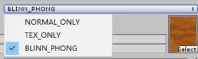

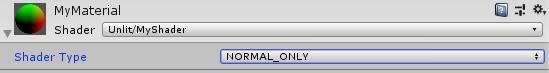

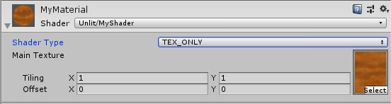

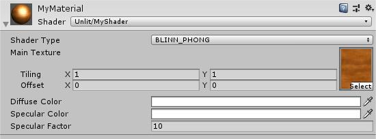

### Debug工具

首先尝试了RenderDoc的使用，从官网下载RenderDoc安装程序并安装，然后在Unity的界面中右击Scene或Game就能够看到Load RenderDoc的选项，如图所示：

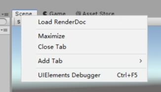

然而当我点击Load RenderDoc时，Unity出现了闪退的情况，无法使用RenderDoc，于是我改用了Unity自带的FrameDebugger。

依次点击Window - Analysis - Frame Debugger便能够出现Frame Debugger的界面，然后点击Enable，选择其中的Draw Mesh Sphere便得到了以下的界面：

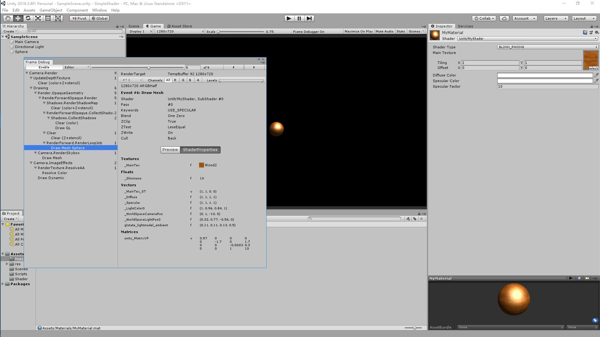

从这里能够看到纹理及程序中使用的一些参数，点击右侧的Preview还能够查看三角面片的信息。

### 进阶功能1——波浪纹理的实现

实现波浪纹理的具体思路是：先让平面能以正弦函数的形式进行波动，然后贴上纹理，再叠加一个噪声纹理使得纹理看上去随着水面（原先平面）的波动而变化。

在Vertex Shader中加入代码使平面进行波动：

```c#
v.position.y += _Amplitude *sin(v.position.z + v.position.x + _Time.y);
v.position.y += _Amplitude *sin((v.position.z - v.position.x) + _Time.w);
```

其中，`_Amplitude`为用户可定的波浪波动幅度，`_Time`为内置的时间函数。然后在Fragment Shader中将`i.uv`叠加噪声函数差生纹理的变化效果，代码如下：

```c#
float2 waveOffset = (tex2D(_NoiseTex, i.uv.xy + float2(0, _Time.y * _SpeedY)).rg + tex2D(_NoiseTex, i.uv.xy + float2(_Time.w * _SpeedX, 0)).rg) - 1;
float2 ruv = float2(i.uv.x, 1 - i.uv.y) + waveOffset * _Indentity;
```

将最终实现的Shader使用到一个平面上产生了平面进行波动，同时纹理也在变化之中的效果。

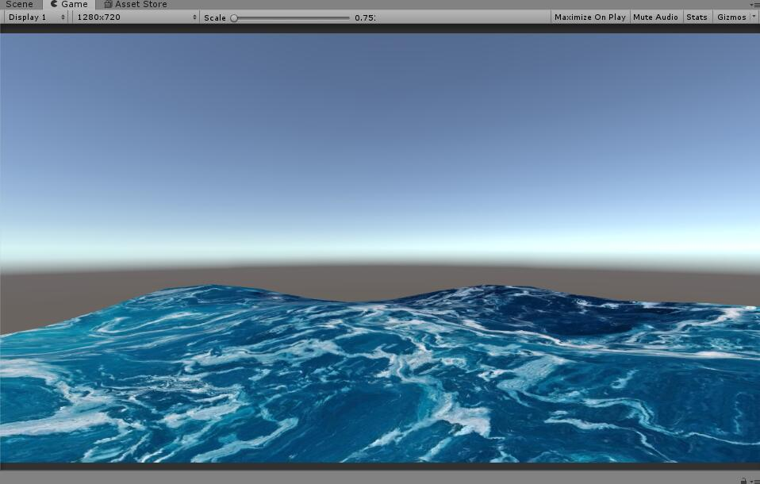

### 进阶功能2——Geometry Shader实现毛发效果

实现毛发效果的具体思路是：从三角面片的三条边分别生出一个三角形交于一个顶点，变成一个三棱锥，使模型有毛茸茸的效果。

首先相比于前面的Shader，要多定义一个`GeometryData`类型，多定义一个`MyGeometryProgram`功能，并且在`MyGeometryProgram`中实现上述效果。

首先需要得到法线方向，并且得到三角面片的中心点，来确定生成三棱锥的方向和顶点的位置：

```c#
float3 edgeA = g[1].position - g[0].position;
float3 edgeB = g[2].position - g[0].position;
float3 normalFace = normalize(cross(edgeA, edgeB));

float3 centerPos = (g[0].position + g[1].position + g[2].position) / 3;
float2 centerTex = (g[0].uv + g[1].uv + g[2].uv) / 3;
centerPos += float4(normalFace, 0) * _FurFactor;
```

然后根据法线方向和顶点位置，使用for循环语句，从每条边生成一个三角形

```c#
for (uint i = 0; i < 3; i++)
{
    o.position = UnityObjectToClipPos(g[i].position);
	o.uv = g[i].uv;
	o.col = fixed4(0, 0, 0, 1);

	tristream.Append(o);

	uint index = (i + 1) % 3;
	o.position = UnityObjectToClipPos(g[index].position);
	o.uv = g[index].uv;
	o.col = fixed4(0, 0, 0, 1);

	tristream.Append(o);

    o.position = UnityObjectToClipPos(float4(centerPos, 1));
	o.uv = centerTex;
	o.col = fixed4(1.0, 1.0, 1.0, 1);

	tristream.Append(o);

	tristream.RestartStrip();
}
```

最终实现的效果如下：

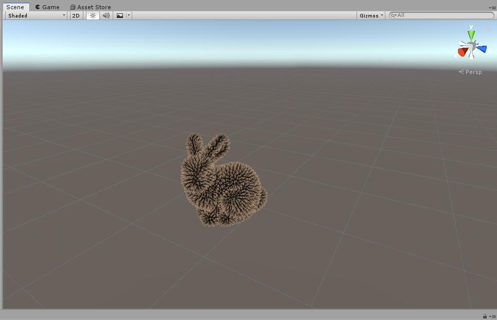

