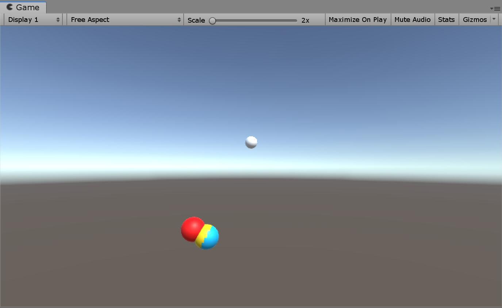
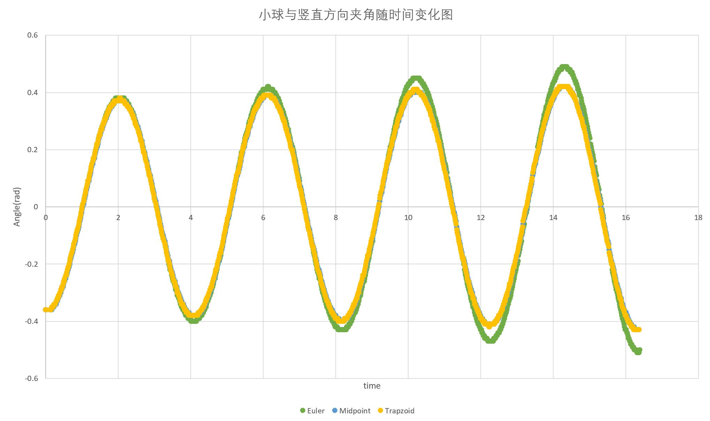
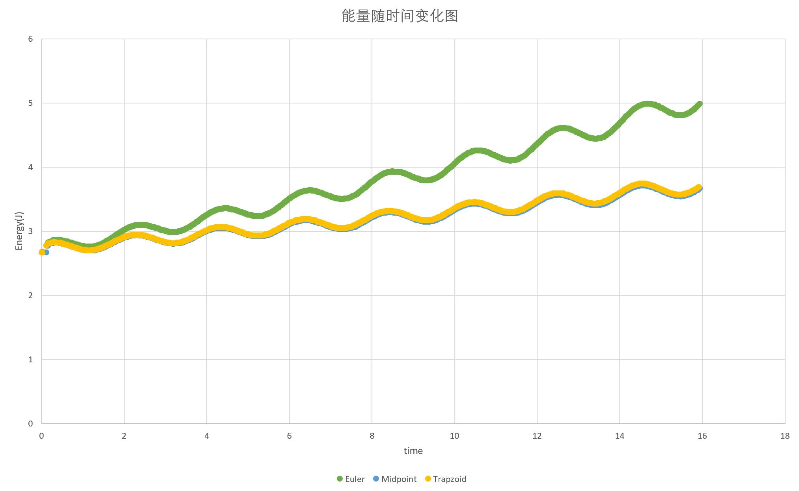
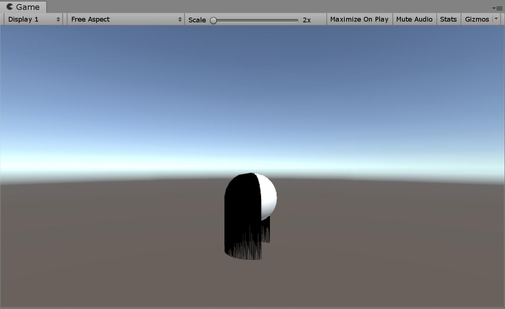

# HW5 实验报告

516030910381 姜凡叙

### 单摆模拟

##### 场景搭建

新建一个场景，在场景中放入四个球，一个作为顶点Top，其余三个分别为用三种方法实现的单摆球，并放置在同一位置。创建一个Empty Object用来搭载导出数据的脚本。

##### 单摆球属性

- 重力加速度 `g`
- 摆长 `l`
- 与竖直方向的夹角 `theta`
- 角速度 `omega`

##### 单摆球的运动

在`Update`中使用了如下代码来使小球进行摆动，并且计算与竖直方向的夹角：

```c#
Sphere.RotateAround(Top.position, new Vector3(0, 0, -1), transAngle);
theta = Vector3.Angle(Sphere.position - Top.position, new Vector3(0, -1, 0));
```

其中`transAngle`根据`omega`计算而来。

而根据公式$\omega^{n+1}=\omega ^n-\frac{g}{l}sin\theta \Delta t$

我们能够得到`deltaOmega`

```c#
float deltaOmega = g / l * Mathf.Sin(Mathf.Deg2Rad * theta) * Time.deltaTime;
```

然后能够得知新的`omega`

```c#
if (Top.position.x > Sphere.position.x)
{
    omega = omega - deltaOmega;
}
else
{
    omega = omega + deltaOmega;
}
```

在不同的方法中，只需要用不同的方式来计算`transAngle`就可以了。

##### Euler方法

根据公式$x(t_0+h)=x_0+hf(x_0)$

Euler方法直接使用`omega`得到`transAngle`

```c#
transAngle = omega;
```

##### Midpoint方法

根据公式$x(t_0+h)=x_0+hf(x_0+\frac{h}{2}f(x_0))$

Midpoint方法计算一半路程时的速度来计算`transAngle`

我们有公式$v_t^2-v_0^2=2ax$

在运动过程中近似认为`deltaT`内加速度恒定，则可以推测出运动到一半路程时的角速度为

$\omega_{half} = \sqrt{\omega_0^2+\omega_t^2}$

然后得到`transAngle`

```c#
if (omega > 0)
{
    transAngle = Mathf.Sqrt((Mathf.Pow(omega, 2) + Mathf.Pow(tmpOmega, 2)) / 2);
}
else
{
    transAngle = -Mathf.Sqrt((Mathf.Pow(omega, 2) + Mathf.Pow(tmpOmega, 2)) / 2);
}
```

##### Trapzoid方法

根据公式$x(t_0+h)=x_0+h\frac{f(x_0)+f(x_0+hf(x_0))}{2}$

Trapzoid方法计算前一个`omega`与后一个`omega`的平均值来计算`transAngle`

```c#
transAngle = (tmpOmega + omega) / 2;
```

##### 效果比较

分别将使用Euler方法、Midpoint方法和Trapzoid方法的小球涂成了红色、蓝色和黄色，当点击运行时能够观察到下面的结果：



可以看出使用Midpoint方法与Trapzoid方法的单摆球运动基本一致，而使用Euler方法的单摆球运动要滞后一些。随着时间的增长，三个球摆动的幅度都会越来越大，而使用Euler方法的单摆球幅度的变化更为快速、明显。

##### 数据输出与分析

这里使用`StreamWriter`来将运行的数据输出到文件当中，首先生成新的文件来储存数据，并初始化文件开头。

```c#
FileStream angleFile = new FileStream(
    @"D:/Proj/UnityProj/PhysicsAndHair/Data/Angle.txt", 
    FileMode.Create);
sw1 = new StreamWriter(angleFile);

FileStream energyFile = new FileStream(
    @"D:/Proj/UnityProj/PhysicsAndHair/Data/Energy.txt", 
    FileMode.Create);
sw2 = new StreamWriter(energyFile);

sw1.WriteLine("Time\tEuler\tMidpoint\tTrapzoid");
sw2.WriteLine("Time\tEuler\tMidpoint\tTrapzoid");
```

在`Update`得到每个小球当前与竖直方向的夹角和角速度，并且计算能量

```c#
theta1 = Vector3.Angle(EulerSphere.position - Top.position, 
                       new Vector3(0, -1, 0)) * Mathf.Deg2Rad;
theta2 = Vector3.Angle(MidpointSphere.position - Top.position, 
                       new Vector3(0, -1, 0)) * Mathf.Deg2Rad;
theta3 = Vector3.Angle(TrapzoidSphere.position - Top.position, 
                       new Vector3(0, -1, 0)) * Mathf.Deg2Rad;
theta1 = Top.position.x > EulerSphere.position.x ? -theta1 : theta1;
theta2 = Top.position.x > MidpointSphere.position.x ? -theta2 : theta2;
theta3 = Top.position.x > TrapzoidSphere.position.x ? -theta3 : theta3;

omega1 = EulerSphere.GetComponent<EulerController>().omega;
omega2 = MidpointSphere.GetComponent<MidpointController>().omega;
omega3 = TrapzoidSphere.GetComponent<TrapzoidController>().omega;
float energy1 = Mathf.Pow(omega1 * l, 2) / 2 + g * l * (1 - Mathf.Cos(theta1));
float energy2 = Mathf.Pow(omega2 * l, 2) / 2 + g * l * (1 - Mathf.Cos(theta2));
float energy3 = Mathf.Pow(omega3 * l, 2) / 2 + g * l * (1 - Mathf.Cos(theta3));
```

然后将结果输出到文件

```c#
float time = Time.time;
sw1.WriteLine(time.ToString("f2") + "\t" + 
              theta1.ToString("f2") + "\t" +
              theta2.ToString("f2") + "\t" + 
              theta3.ToString("f2"));

sw2.WriteLine(time.ToString("f2") + "\t" +
              energy1.ToString("f2") + "\t" +
              energy2.ToString("f2") + "\t" +
              energy3.ToString("f2"));
```

在Unity中运行场景一段时间，文件中便记录了许多数据，将这些数据导入到Excel当中，并且绘制图像，得到了三种方法下小球角度、能量随时间变化的图像





### 头发模拟

##### 发丝的建立

建立一个LineRenderer，然后在其下建立十个球作为节点，将LineRenderer中的position属性中的size调整为10，以能够建立十段线条，并且调整颜色为黑色。调整头和发丝节点的大小，以便能够产生头发贴在头皮上的较好的效果。

在LineRenderer上添加`HairPoint.cs`脚本，用来生成线条并且对各个节点进行约束。根据所给的文章，首先建立`HairNode`的class：

```c#
public class HairNode
{
    public Vector3 prePos, curPos;
    public Transform pointTrans;
}
```

在`Start`中初始化Hair Node List，并且将各个节点连接起来形成一条发丝

```c#
hairNodes = new List<HairNode>();
for (int i = 0; i < transform.childCount; i++)
{
    HairNode hairNode = new HairNode();
    hairNode.pointTrans = transform.GetChild(i);
    hairNode.curPos = transform.GetChild(i).position;
    hairNode.prePos = transform.GetChild(i).position;
    hairNodes.Add(hairNode);
}
rootPos = hairNodes[0].curPos;
selfLinerender = this.GetComponent<LineRenderer>();
for (int i = 0; i < hairNodes.Count; i++)
{
    selfLinerender.SetPosition(i, hairNodes[i].curPos);
}
```

然后在`Update`中对节点进行Verlet、CollideSphere、LengthConstraint三项约束

```c#
for (int i = 0; i < hairNodes.Count; i++)
{
    Verlet(hairNodes[i]);
}
for (int i = 1; i < hairNodes.Count; i++)
{
    collideSphere(hairNodes[i]);
}
for (int i = 0; i < hairNodes.Count - 1; i++)
{
    lengthConstraint(hairNodes[i], hairNodes[i + 1], i);
}
```

然后去实现这三项约束。

根据公式$x(t+\Delta t)=x(t)+d\cdot (x(t)-x(t-\Delta t))+a(t)\Delta t^2$

能够得到Verlet约束的代码：

```c#
Vector3 nextPos = hairNode.curPos + D * (hairNode.curPos - hairNode.prePos) +
            at * Mathf.Pow(deltaT, 2);
```

其中`at`为重力等所有外力的和。

在CollideSphere约束中，需要判断节点是否与头碰撞，来保证发丝紧贴头皮而不是从头中穿过。这只需要进行距离的判断就可以完成：

```c#
float distance = Vector3.Distance(hairNode.curPos, Head.position);
```

如果得到的距离小于头和节点的半径之和，则节点各个方向都向偏离头部的方向移动一点，把头内的节点推到头皮表面上。

关于LengthConstrain，由于不是非常理解，咨询了其他同学，虽然补充了代码不过仍然有疑问。

##### 头发的生成

将上面生成的发丝围着头顶的中心点进行旋转，在一定的角度内每隔一定度数生成一根发丝，这样最终就能得到“浓密”的头发了。

```c#
hairSet = new List<GameObject>();
for (int idx = 0; idx < hairSize; idx++)
{
    GameObject hair = Instantiate(backhair) as GameObject;
    hair.transform.SetParent(transform);
    hair.transform.RotateAround(new Vector3(0, hair.transform.position.y, 0), 
                                new Vector3(0, -1, 0), 240 / hairSize * (idx + 1));
}
```

生成的效果如下：



##### 头部的运动

建立`HeadController.cs`脚本，绑定在头上。运动代码很简单，不过遇到的一个问题就是头部运动时如何让发丝也跟着头部进行运动。

于是在脚本中定义了一个`private GameObject[] gameObjects`来存储所有生成的发丝，并且通过调整`gameObjects[i].GetComponent<HairPoint>().rootPos`的方法来控制发丝的运动。

旋转头部的时候，`rootPos`的计算就变得困难起来。

```c#
for (int i = 0; i < gameObjects.Length; i++)
{
    Vector3 center = new Vector3(transform.position.x,
                                 gameObjects[i].GetComponent<HairPoint>().rootPos.y,
                                 transform.position.z);
    Vector3 point = Quaternion.AngleAxis(rotSpeed * Time.deltaTime,
        			new Vector3(0, 1, 0)) * 
        			(gameObjects[i].GetComponent<HairPoint>().rootPos - center);
    gameObjects[i].GetComponent<HairPoint>().rootPos = point + center;
}
```

首先计算头顶的中心点，然后计算`rootPos`相对于该中心点的位置，再将两个数据加起来作为新的`rootPos`。

- 运行时，按‘W’、‘S’、‘A’、‘D’来控制头部向四个方向的移动，按‘Q’、‘E’来控制头部的旋转。

##### 外力

在`HairPoint.cs`的`Update`中调用`ChangeForce()`来调整外力，代码非常简单，只需要实现通过按键调整`Vector3 Force`的各个值的大小。

- 运行时，按‘↑’、‘↓’、‘←’、‘→’、‘,’和‘.’来控制外力的y、x和z的三个方向的力的大小，并且某个键按的次数越多该方向上的外力越大。

##### UI界面

建立UI界面，建立三个Slider，分别代表重力、头发长度和D。调整到合适位置后建立`SliderController.cs`脚本来控制Slider滑动事件。

初始化三个Slider的值为节点的属性值

```c#
hairRoots = GameObject.FindGameObjectsWithTag("HairRoot");

mSlider.value = hairRoots[0].GetComponent<HairPoint>().g;
lSlider.value = hairRoots[0].GetComponent<HairPoint>().length;
DSlider.value = hairRoots[0].GetComponent<HairPoint>().D;
```

然后在`Update`中根据滑动来改变上述三个属性的值

```c#
for (int i = 0; i < hairRoots.Length; i++)
{
    hairRoots[i].GetComponent<HairPoint>().g = mSlider.GetComponent<Slider>().value;
    hairRoots[i].GetComponent<HairPoint>().length = lSlider.GetComponent<Slider>().value;
    hairRoots[i].GetComponent<HairPoint>().D = DSlider.GetComponent<Slider>().value;
}
```

然后运行，拖动Slider便能够看到很明显的现象了。

##### 帧率显示

帧率即为单位时间内执行的`Update`次数。新建一个脚本，在`Update`中加入如下代码来计算并显示FPS。

```c#
++frames;
float timeNow = Time.realtimeSinceStartup;
if (timeNow > lastInterval + updateInterval)
{
    fps = (float)(frames / (timeNow - lastInterval));
    frames = 0;
    lastInterval = timeNow;
}
this.GetComponent<Text>().text = "FPS: " + fps;
```

`frame`用来计数，当运行时间超过了设定的FPS更新时间时，利用`frame`与运行的时间来计算当前的FPS，并重新开始计时，然后将FPS更新到UI界面上。

##### 遇到的问题

- 生成头发时本来打算同时生成前方较短的头发，使头部一周都有头发，不过产生了前后头发运动不同步的问题，奈何无法解决，只能够放弃这个想法。

- 在运动头部时，发现只有一根头发跟着头部运动，其余的头发都留在了原地。推测是`Start`执行顺序的原因，导致在得到所有头发时只得到了最初始的一根，其余的还没有来得及生成。于是在`Update`中添加了下面的改进代码：

  ```c#
  if (gameObjects.Length == 1)
  {
      gameObjects = GameObject.FindGameObjectsWithTag("HairRoot");
      Debug.Log(gameObjects.Length);
  }
  ```

  发现这样便正常了。